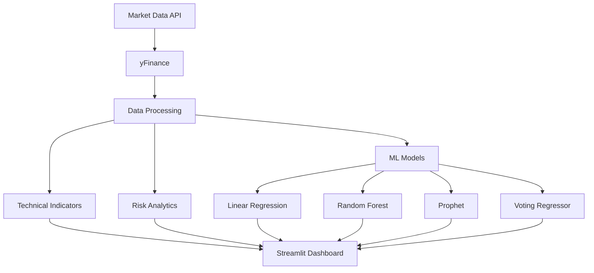

# 📈 Stock Data Analyzer  
### *AI-Powered Quantitative Trading Dashboard*

<p align="center">


</p>

<p align="center">
  <b>A Professional-Grade Financial Analytics Platform built with AI, Quantitative Models, and Interactive Visualization.</b>
</p>

---

## ✨ Live Preview

<p align="center">
  
</p>

---

# 🎯 What This Project Does

Stock Data Analyzer transforms raw market data into actionable insights using:

✅ Real-time market analytics  
✅ Technical indicator computation  
✅ AI-driven stock forecasting  
✅ Risk analysis & volatility tracking  
✅ Interactive trading charts  

---

# 🚀 Core Features

## 📊 Quantitative Analytics Engine

<details>
<summary><b>Click to Explore</b></summary>

### Market Data
- Real-time stock market data using `yfinance`
- Historical OHLCV price extraction
- Multi-stock comparison engine

### Technical Indicators
- 📈 RSI (Relative Strength Index)
- 📉 MACD (Moving Average Convergence Divergence)
- 📊 SMA & EMA Moving Averages
- 📍 Trend & momentum detection

### Risk Analytics
- Annualized Volatility
- Rolling Standard Deviation
- Return Distribution Analysis

</details>

---

## 🤖 AI Forecasting Engine

<details>
<summary><b>Click to Explore</b></summary>

### Machine Learning Models

| Model | Purpose |
|-------|---------|
| Linear Regression | Trend Prediction |
| Random Forest | Non-linear Price Forecasting |
| Prophet | Time-Series Trend Analysis |
| Voting Regressor | Ensemble Prediction |

### Performance Metrics
- RMSE Analysis
- Directional Accuracy
- Prediction Confidence Score

</details>

---

## 📈 Interactive Visualization

<details>
<summary><b>Click to Explore</b></summary>

### Dashboard Includes:
- Interactive Plotly Candlestick Charts
- Buy/Sell Signal Overlay
- Historical vs Predicted Price Comparison
- Trend Heatmaps
- Volume Distribution Analysis

</details>

---

# 🧠 System Architecture



---

# 🛠️ Tech Stack

## Backend & Data Science

| Technology | Usage |
|------------|------|
| Python | Core Development |
| Pandas | Data Manipulation |
| NumPy | Numerical Computing |
| Scikit-Learn | Machine Learning |
| Prophet | Forecasting |

---

## Frontend & Visualization

| Technology | Usage |
|------------|------|
| Streamlit | Interactive Dashboard |
| Plotly | Financial Charts |
| Matplotlib | Statistical Visualization |

---

# ⚙️ Installation

## 1️⃣ Clone Repository

```bash
git clone https://github.com/mitsshivashish/Stock-Prize-Analyzer.git
cd Stock-Prize-Analyzer
```

---

## 2️⃣ Install Dependencies

```bash
pip install -r requirements.txt
```

---

## 3️⃣ Launch Dashboard

```bash
streamlit run stock_analyzer.py
```

---

# 📊 Model Performance Dashboard

The application continuously evaluates prediction quality using:

## Evaluation Metrics

| Metric | Description |
|--------|-------------|
| RMSE | Price Prediction Error |
| MAE | Average Prediction Error |
| Accuracy | Trend Prediction Success |
| Volatility Score | Market Risk Indicator |

---

# 💡 Project Highlights

✔ Real-time stock analysis  
✔ Multi-model AI forecasting  
✔ Quantitative trading indicators  
✔ Interactive UI/UX  
✔ Risk management analytics  

---

# 📂 Project Structure

```bash
Stock-Data-Analyzer/
│
├── stock_analyzer.py
├── requirements.txt
├── models/
├── data/
├── utils/
├── charts/
└── README.md
```

---

# 🔮 Future Enhancements

- [ ] Deep Learning (LSTM Forecasting)
- [ ] Portfolio Optimization
- [ ] Sentiment Analysis using News API
- [ ] Cryptocurrency Support
- [ ] Trading Strategy Backtesting

---

# 🤝 Contributing

Contributions are always welcome.

```bash
Fork → Clone → Create Branch → Commit → Push → Pull Request
```

### Workflow

```bash
git checkout -b feature/amazing-feature
git commit -m "Added new feature"
git push origin feature/amazing-feature
```

---

# 👨‍💻 Developer

## Shivashish

Passionate about:
- Quantitative Finance
- Machine Learning
- Software Engineering
- Financial Technology

---

# 📜 License

This project is licensed under the **MIT License**.

---

<p align="center">

### ⭐ If you found this project useful, consider giving it a star!

</p>